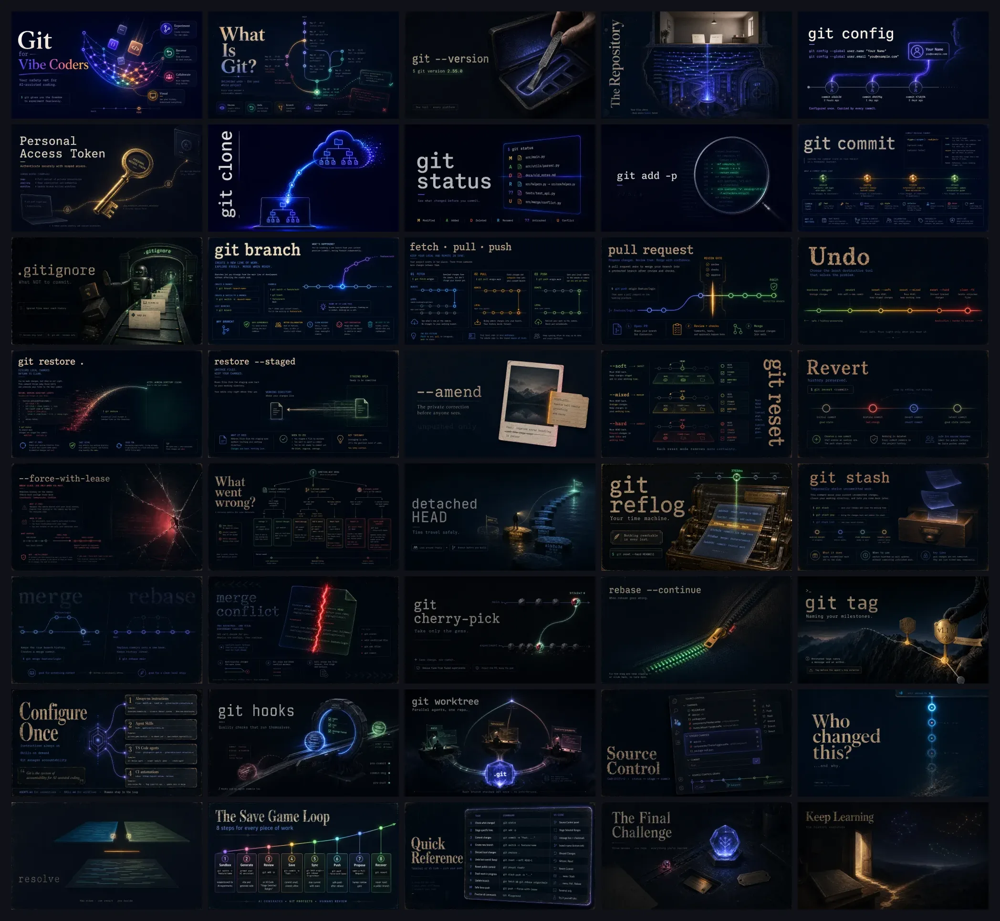
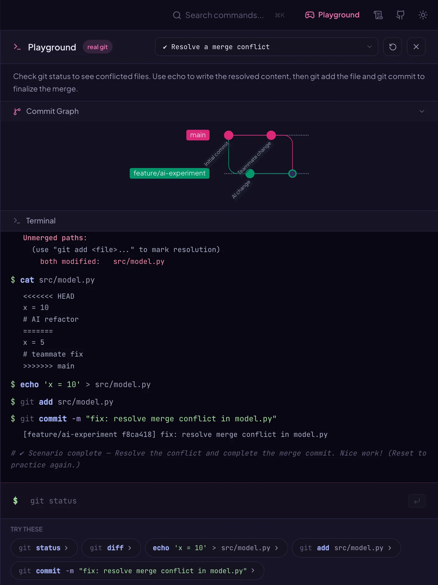
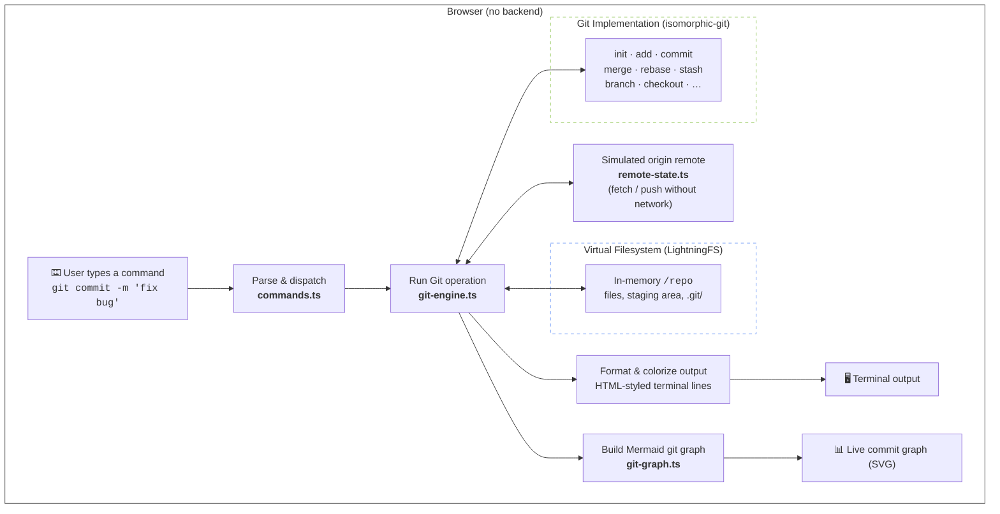

<p align="center">
  
</p>

# GitVibes — Git for Vibe Coders

An interactive, visual guide to Git for developers who use AI-assisted coding tools like GitHub Copilot, Cursor, and Claude Code.

**[Live Site →](https://neovand.github.io/gitvibes/)**

<p align="center">
  <a href="https://github.com/NeoVand/gitvibes/releases"></a>
  <a href="https://github.com/NeoVand/gitvibes/actions/workflows/deploy.yml"></a>
  
  <br />
  
  
  
  
  
  
</p>


## What is this?

GitVibes teaches Git through the lens of AI-assisted development. Instead of dry reference docs, it walks through real scenarios — _"the AI just changed 10 files, what do I do?"_ — with cinematic section banners, interactive playgrounds, Mermaid diagrams, and step-by-step VS Code screenshots.

Every lesson opens with an original piece of banner art — all **40** of them, in curriculum order:

[](docs/images/banner-poster.webp)

### Curriculum

| Part                         | Topics                                                                                                  |
| ---------------------------- | ------------------------------------------------------------------------------------------------------- |
| **Introduction**             | What Git is, installing Git, what a repository is                                                       |
| **1. Enterprise Onboarding** | Git config, authentication, cloning                                                                     |
| **2. Core Safety Loop**      | `git status` → stage → commit, reviewing AI changes, `.gitignore` & secrets hygiene                     |
| **3. Branching & PRs**       | Branches, fetch/pull/push, pull requests                                                                |
| **4. Undo Toolkit**          | Restore, unstage, amend, reset, revert, force-with-lease, recovery matrix, detached HEAD, reflog rescue |
| **5. Advanced Workflows**    | Stash, rebase vs merge, merge conflicts, cherry-pick, rebase conflict recovery, tags & releases         |
| **6. Git for AI Agents**     | Teaching agents Git (`AGENTS.md`, skills), enforcing standards with hooks, parallel agents w/ worktrees |
| **7. VS Code Cockpit**       | Source Control, Timeline & GitLens, 3-way merge editor                                                  |
| **8. Conclusion**            | The AI-first workflow, quick reference card, the Final Challenge, the forges beyond GitHub              |

### Features

- **Git Playground** — run real Git commands in the browser (isomorphic-git), opened as a sidebar panel from anywhere on the site
- **20 hands-on exercises** with live success detection — a ✔ fires the moment the repo reaches the goal state, from the core loop to `bisect`, interactive rebase, hook guardrails, worktree fleets, and a three-messes-at-once capstone
- **A truthful commit graph** — real fork points, real merge edges, tags, remote-tracking positions, and detached-HEAD markers, redrawn after every command
- **`undo` / `redo` / `share`** in every terminal — share serializes your exact session into a link anyone can replay
- **Progress that persists** — sections read, exercises completed, a self-assessed skill checklist, and spaced-repetition refresher nudges (all localStorage; no accounts, no backend)
- **Expandable banners** — click any section poster to open a full-screen lightbox
- **VS Code screenshots** — real UI with hover-to-expand and captions
- **Vibe prompts** — copy-paste AI prompts for common Git workflows
- **Search** — `⌘K` / `Ctrl+K` command palette with panic-query aliases ("oops", "undo reset --hard", "wrong branch")
- **Cheat sheet** — quick command reference from the header, expandable into a full-screen three-column view, downloadable as a typeset PDF
- **Light / dark theme**, installable as a PWA, works offline after one visit
- **Fully static** — no backend; deploys to GitHub Pages

## How the Git Playground works

The playground lets you run real Git commands in the browser — no server, no sandboxed iframe. It pairs [isomorphic-git](https://isomorphic-git.org/) (a full Git implementation in JavaScript) with [LightningFS](https://github.com/nicolo-ribaudo/lightning-fs) (an in-memory virtual filesystem backed by IndexedDB) so every `git commit`, `git merge`, and `git stash` behaves like the real thing.

Here's the merge-conflict exercise mid-session. Everything in the terminal is genuine Git: `git status` reporting unmerged paths, `cat` showing the actual `<<<<<<<` conflict markers isomorphic-git wrote into the file, a resolving commit with its real hash — and the moment the merge completes, the success check fires and the commit graph redraws with both branches joined by a true merge node:

<p align="center">
  
</p>



After every command, both the terminal and the commit graph update in sync — so you can see the effect of each operation instantly. Scenarios pre-seed the virtual repo with commits, branches, and working-tree changes to set up each lesson.

## Tech stack

| Layer          | Tool                                          |
| -------------- | --------------------------------------------- |
| Framework      | [SvelteKit](https://svelte.dev) (Svelte 5)    |
| Styling        | [Tailwind CSS](https://tailwindcss.com) v4    |
| In-browser Git | [isomorphic-git](https://isomorphic-git.org/) |
| Diagrams       | [Mermaid.js](https://mermaid.js.org)          |
| Icons          | [Lucide](https://lucide.dev)                  |
| Testing        | [Playwright](https://playwright.dev)          |
| Hosting        | GitHub Pages (`@sveltejs/adapter-static`)     |

## Getting started

```bash
git clone https://github.com/NeoVand/gitvibes.git
cd gitvibes
npm install
npm run dev
```

Open [http://localhost:5173](http://localhost:5173).

## Scripts

| Command           | Description                        |
| ----------------- | ---------------------------------- |
| `npm run dev`     | Start dev server                   |
| `npm run build`   | Production build → `build/`        |
| `npm run preview` | Preview production build           |
| `npm run check`   | Type-check                         |
| `npm run lint`    | Prettier + ESLint                  |
| `npm run test`    | Vitest unit + Playwright e2e tests |

## Assets

Section banner images live in `static/images/` (kebab-case filenames). Image generation prompts for creating or updating posters are in [`docs/IMAGE_PROMPTS.md`](docs/IMAGE_PROMPTS.md). Drop new art in as PNG and run `node scripts/optimize-images.mjs` to convert it to WebP, then `node scripts/make-poster.mjs` to refresh the banner poster above (it reads the curriculum order straight from the section components).

The downloadable cheat sheet PDF (`static/gitvibes-cheatsheet.pdf`) is rendered from the unlisted `/cheatsheet-print` route — after editing `src/lib/data/cheat-sheet.ts`, regenerate it with `node scripts/make-cheatsheet-pdf.mjs` (dev server running).

VS Code screenshots under `static/images/vscode/` are from the [Visual Studio Code documentation](https://code.visualstudio.com/docs/sourcecontrol/overview) (© Microsoft, [CC BY 3.0](https://github.com/microsoft/vscode-docs/blob/main/License.md)), vendored so the site has no runtime dependency on the docs CDN.

## Deployment

Pushes to `main` deploy automatically to GitHub Pages via [`.github/workflows/deploy.yml`](.github/workflows/deploy.yml).

## License

MIT
