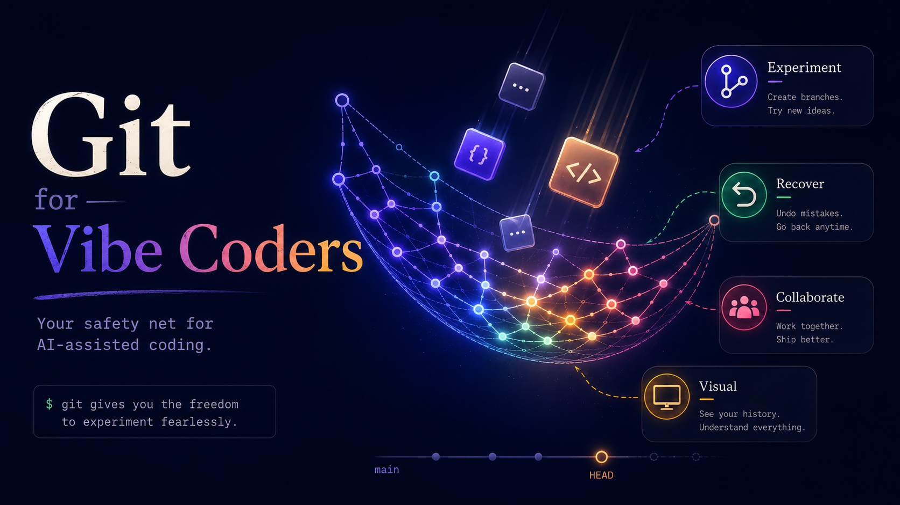

# GitVibes — Git for Vibe Coders

An interactive, visual guide to Git for developers who use AI-assisted coding tools like GitHub Copilot, Cursor, and Claude Code.

**[Live Site →](https://neovand.github.io/gitvibes/)**



## What is this?

GitVibes teaches Git through the lens of AI-assisted development. Instead of dry reference docs, it walks through real scenarios — *"the AI just changed 10 files, what do I do?"* — with cinematic section banners, interactive playgrounds, Mermaid diagrams, and step-by-step VS Code screenshots.

### Curriculum

| Part | Topics |
|------|--------|
| **Introduction** | What Git is, installing Git, what a repository is |
| **1. Enterprise Onboarding** | Git config, authentication, cloning |
| **2. Core Safety Loop** | `git status` → stage → commit, reviewing AI changes |
| **3. Branching & PRs** | Branches, fetch/pull/push, pull requests |
| **4. Undo Toolkit** | Restore, unstage, amend, reset, revert, force-with-lease, recovery matrix |
| **5. Advanced Workflows** | Stash, rebase vs merge, merge conflicts |
| **6. VS Code Cockpit** | Source Control, Timeline & GitLens, 3-way merge editor |
| **7. Conclusion** | AI-first workflow, quick reference card, teaching agents Git (`AGENTS.md`, skills, custom agents) |

### Features

- **Git Playground** — run real Git commands in the browser (isomorphic-git), opened as a sidebar panel from anywhere on the site
- **Try it yourself** — embedded playground tabs in hands-on lessons (Parts 2–5)
- **Expandable banners** — click any section poster to open a full-screen lightbox
- **VS Code screenshots** — real UI with hover-to-expand and captions
- **Vibe prompts** — copy-paste AI prompts for common Git workflows
- **Search** — `⌘K` / `Ctrl+K` command palette across the whole tutorial
- **Cheat sheet** — quick command reference from the header
- **Light / dark theme**
- **Fully static** — no backend; deploys to GitHub Pages

## Tech stack

| Layer | Tool |
|-------|------|
| Framework | [SvelteKit](https://svelte.dev) (Svelte 5) |
| Styling | [Tailwind CSS](https://tailwindcss.com) v4 |
| In-browser Git | [isomorphic-git](https://isomorphic-git.org/) |
| Diagrams | [Mermaid.js](https://mermaid.js.org) |
| Icons | [Lucide](https://lucide.dev) |
| Testing | [Playwright](https://playwright.dev) |
| Hosting | GitHub Pages (`@sveltejs/adapter-static`) |

## Getting started

```bash
git clone https://github.com/NeoVand/gitvibes.git
cd gitvibes
npm install
npm run dev
```

Open [http://localhost:5173](http://localhost:5173).

## Scripts

| Command | Description |
|---------|-------------|
| `npm run dev` | Start dev server |
| `npm run build` | Production build → `build/` |
| `npm run preview` | Preview production build |
| `npm run check` | Type-check |
| `npm run lint` | Prettier + ESLint |
| `npm run test` | Playwright e2e tests |

## Assets

Section banner images live in `static/images/` (kebab-case filenames). Image generation prompts for creating or updating posters are in [`docs/IMAGE_PROMPTS.md`](docs/IMAGE_PROMPTS.md).

## Deployment

Pushes to `main` deploy automatically to GitHub Pages via [`.github/workflows/deploy.yml`](.github/workflows/deploy.yml).

## License

MIT
